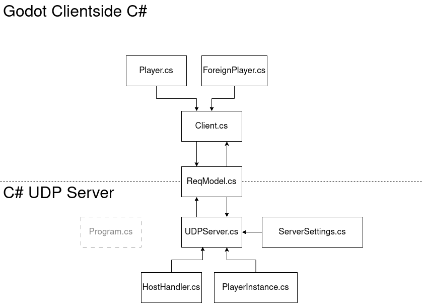

## 🔨 How does it work?

in `master`

Really simple:
First let me show a diagram that shows the interaction between the classes and the client and server side:

### Client

This is a Godot Game with a script thats responsible to connect you to our server

- `Client.cs`:
  The "root" of our client, and it's responsability is to keep us connected with the server.
- `Player.cs`:
  It's basically the player, that's what you're going to edit if you want to modify this framework.
- `ForeignPlayer.cs`:
  A gameobject that represents other players in the game, and is updated by the server

### Shared

So far there is only one "script" that is shared between the client and the server, and that is `ReqModel.cs`.

Now as you may guess from the name it's a model, rather than a script (that's why script was in quotation in the first paragraph). It basically contains the description of what the packet we're sending (either from the server or the client) will say. The field that we're most intrested in is the `Type` field, that contains a string that's going to specify what our request is. _For example_: a JOIN request that the client makes when trying to connect, if the client gets a positive response from the server, the client will then actually join.

### Server

And now for the last piece of this stack, the server!

- `Program.cs`:
  Starts UDPServer.cs
- `UDPServer.cs`:
  The "root" of our server. It recieves and sends signals.
- `ServerSettings.cs`:
  A centralized(static) place for storing server settings.

And now we get onto the host handling section, which is responsible of Accepting, Updating and Disconnecting clients

- `HostHandler.cs`: Accepts, Updates and Disconnects players. That's it.
- `PlayerInstance.cs`: An abstract representation of a client/player. It is used in `HostHandler.cs` to represent a player.

So in MVC `PlayerInstance.cs` would be a model, and `HostHandler.cs` a controller.

### What can be made better?

While the client-server connection works and it is possible to create a simple multiplayer game to play with friends this framework is actually unusable for competitive games, as most of the calculations are done in the client side and so it is not possible for the server to check if a client is cheating by, for example, increasing his speed.

## Conclusions

That's pretty much it. The code might have seemed a little long at first, but this document should explain what each script does and how they work togheter to form this framework.
